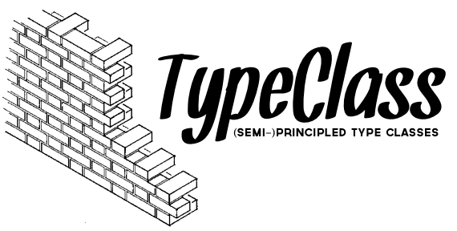

[](https://travis-ci.org/expede/type_class) [](http://inch-ci.org/github/expede/type_class) [](https://beta.hexfaktor.org/github/expede/type_class) [](https://hex.pm/packages/type_class) [](http://hexdocs.pm/type_class/) [](https://github.com/expede/type_class/blob/master/LICENSE)

`TypeClass` brings (semi-)[principled](http://degoes.net/articles/principled-typelasses) [type classes](https://en.wikibooks.org/wiki/Haskell/Classes_and_types) to Elixir

# Table of Contents

- [Quick Start](#quick-start)
- [Type Classes](#type-classes)
  - [`defclass` and `definst`](#defclass-and-definst)
  - [Hierarchy](#hierarchy)
  - [Principled](#principled)
- [Escape Hatches](#escape-hatches)
- [Example](#example)
  - [TypeClass](#typeclass)
  - [Haskell](#haskell)

# Quick Start

```elixir
def deps do
  [{:type_class, "~> 1.1"}]
end
```

# Type Classes
Type classes are not unlike protocols. They are essentially a mechanism for ad hoc polymorphism. However, doing extensive work with protocols can be cumbersome in Elixir. Even the standard library uses the [`Enumerable`](https://hexdocs.pm/elixir/Enumerable.html) protocol to support the `Enum` module. `TypeClass` attempts to hide many of the details to give you a single module interface.

## Condensed Style
To this end, `TypeClass` provides the `defclass` macro to handle generating all of the modules, submodules, and protocols.

`definstance` is very similar to `defimpl`, except that you don't need to pass it the actual protocol; you only pass it just the "top" class module. It will also automatically run a number of checks at compile time to help keep everything running as per the definition in `defclass` (more on that later)

## Hierarchical
Type classes can be hierarchical. The `extend` macro allows defining another class that your class depends on existing. A common example from Haskell and similar is how the monad instance must also be an applicative, which in turn must be a functor. `definstance` will check that the type you are implementing already has an implementation of the parent classes. Specifying multiple parents is totally okay, as this is superclassing, not subclassing like in an object oriented system.

## Principled
Type classes have the ability to be abused. For instance, in languages such as Haskell, a programmer can define an instance of `Monad a` that is not actually a monad. This can lead to confusing and unexpected behaviour. After all the purpose of protocols and type classes is so that we abstract some invariant behaviour over many data types.

At the core, type classes are about the _properties_ that enable its functions to work correctly. To emphasize that: _properties are the most important part of a type class_. Strictly speaking, for the compiler to enforce properties at compile time, it needs to have a lot of type-level information (ideally dependant types, GADTs, or very advanced static analysis). Elixir is dynamically typed, and has almost no type information at compile time.

`TypeClass` meets this challenge halfway: property testing. `definst` will property test a small batch of examples on every data typed that the class is defined for _at compile time_. By default, it skips this check in production, runs a minimal set of cases in development, and runs a larger suite in the test environment. Property testing lets `TypeClass` check hundreds of specific examples very quickly, so while it doesn't give you a guarantee that your instance is correct, it does give you a high level of confidence.

[John De Goes](http://degoes.net) defines [principled type classes](http://degoes.net/articles/principled-typeclasses) as:

> Haskell-style. A baked-in notion of type classes in the overall style of Haskell, Purescript, Idris, etc.

`defclass` and `definst` get us 99% of the way here. It's not as lightweight as in Haskell &c, but it's close (and much more succinct than what is available in `Kernel`)

> Lawful. First-class laws for type classes, which are enforced by the compiler.

As mentioned above, we meet laws/properties halfway with compile-time property tests.

> Hierarchical. A compiler-verified requirement that a subclass of a type class must have at least one more law than that type class.

`TypeClass` requires at least one property per class. You can build type class hierarchies with `extend`.

> Globally Unambiguous. Type class resolution that produces an error if there exists more than one instances which satisfies the constraints at the point where the compiler must choose an instance.

Elixir is dynamically typed, and so we cannot constrain functions at compile time. However, the point is well taken: rather than creating a renamed variant of a type so that you can have multiple instances (ex. `Monoid` can be integer addition or multiplication), extend the TypeClass and give it the additional properties that you're interested in for each case (ex. `AdditiveMonoid` and `MultiplicativeMonoid` extend `Monoid`).

> Abstractable. The ability to abstract over type classes themselves.

De Goes is referring here to abstracting over type holes. Elixir is dynamically typed, so this one doesn't apply to us.

# Escape Hatches

In the cases that you _really need_ to override the prop checker, you have two options:

## `@force_type_class true`
This will force the prop checker to pass for all data types for the class.
This is generally a bad idea (see section on principled classes above),
but may be nessesary for some extreme edge cases.

Using this option will trigger a compile time warning.

## `@force_type_instance true`
This will force the prop checker to pass for a particular instance.

This is sometimes needed, since TypeClass's property checker
may not be able to accurately validate all data types correctly for
all possible cases, especially when only subsets of built-in types are valid.
(For example, a class that can only be deifned on 2-tuples).

Forcing a type instance in this way is like telling
the checker "trust me this is correct", and should only be used as
a last resort. If at all possible, try to use `custom_generator/1` first.

Using this option will trigger a compile time warning.

## `custom_generator/1`
If you need to specify a certain type of data that conforms to the type class,
you can specify it with `custom_generator` inside of the `definst`.

For example, Tuples should only have instances for 2-tuples for certain classes,
so we can restrict the prop test data to 2-tuples rather than n-tuples.

The generator must conform to the standard unary generator format.

```elixir
definst AwesomeClass, for: Tuple do
  custom_generator(a) do
    {:always_two, a}
  end

  # the rest as normal
  def awesome_level(_), do: 9000
end
```

# Example

## TypeClass

```elixir
defclass Algebra.Monoid do
  extend Algebra.Semigroup

  where do
    def empty(sample)
  end

  properties do
    def left_identity(data) do
      a = generate(data)
      Semigroup.concat(Monoid.empty(a), a) == a
    end

    def right_identity(data) do
      a = generate(data)
      Semigroup.concat(a, Monoid.empty(a)) == a
    end
  end
end
```

## Haskell

The _rough_ equivalent in Haskell

```haskell
module Algebra.Monoid where

class (Setoid a, Semigroup a) => Monoid a where
  identity :: a -> a

  -- Not actually needed in this case
  -- Just here to illustrate including functions for minimal definitions
  append_id :: a -> a
  append_id a = identity a `append` a

instance Monoid [a] where
  identity _ = []
```
